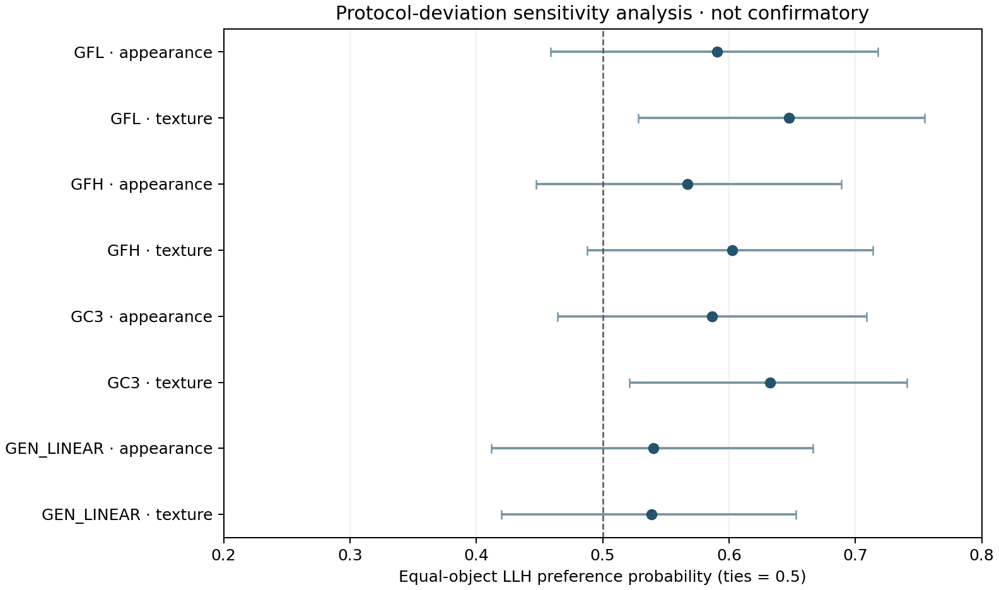

# 人工评测数据接收、协议偏离与敏感性分析

> **历史分类快照：** 本报告生成时将数据标为敏感性分析。2026-10-07 研究负责人确认该研究为确认性人评后，当前分类改为“预先指定端点的确认性分析，伴随已披露的执行偏离”。本报告的原始数据核验、统计结果和偏离事实保持有效；当前允许措辞见 [`HUMAN_STUDY_CONFIRMATORY_REASSESSMENT_20261007_ZH.md`](HUMAN_STUDY_CONFIRMATORY_REASSESSMENT_20261007_ZH.md)。

> **治理裁决更新（2026-10-07）：** 本报告中的数据、偏离和统计结果保持不变；其“科学冻结仍为 NO / human gate OPEN”是当时的门槛快照，现已被 [`HUMAN_EVIDENCE_DISPOSITION_20261007_ZH.md`](HUMAN_EVIDENCE_DISPOSITION_20261007_ZH.md) 与 [`SCIENTIFIC_EVIDENCE_FREEZE_VERDICT_20261007.md`](../../gates/SCIENTIFIC_EVIDENCE_FREEZE_VERDICT_20261007.md) supersede。当前定位为敏感性分析且不阻塞受限主张的证据冻结。

日期：2026-10-06
结论：**已收到数据；37 份答卷满足表内完整性/理解检查；仅作协议偏离后的敏感性分析，不关闭确认性 human-fidelity gate。**

## 数据来源与保护

输入来自 GitHub 分支 `codex/scientific-validation-v3-20261006` 的 commit `f5bad8a1e6ca4265c1823eaa26b2775313de4c96`，目录为 `final/round2/scientific_validation_v3/human_study_results_20261006/`。该 commit 包含原始答卷、槽位任务分配、对象 UID 映射和左右刺激映射。四个源文件的 SHA256、冻结 pair lock 哈希、分析规则和完整端点结果保存在同目录的 `HUMAN_STUDY_ANALYSIS_PROVENANCE_20261006.json`。

我没有把原始答卷复制到 `1006`；此目录只保存可复算脚本、聚合统计和图。原始答卷虽只有匿名 ID、没有姓名/邮箱字段，仍属于参与者级数据。既有交接规则要求这类数据留在协调者私有目录，因此本次公开分支上的原始答卷暴露应作为数据治理偏离记录；后续材料不再复制或再次发布它们。

## 完整性与偏离审计

四份文件在内部能够逐行对上：40 个匿名参与者/槽位、960 条任务记录；每人 24 个不同对象、四个比较各 6 项；24 个对象×4 个比较的 96 个单元格各分配给 10 个槽位。响应、任务分配和 pair mapping 的 960 行全部对应；对象集合与冻结的 24-object cohort 一致，比较集合为 LLH 对 GFL、GFH、GC3 和 `gen_linear`。上传的答案类别为 LEFT/RIGHT/TIE，可由 pair mapping 的左右方法标记确定 LLH 选择。

按原定整人排除标准，1 人有 8 项未完成/缺答，2 人理解检查未通过；排除后 **N=37**，达到数值门槛 36。没有按答案方向、对象或纹理分层排除。全部 40 个槽位在导出中都有记录，但协调者关闭表仍显示 40 个 pending，未提供正式 returned/withdrawn 关闭记录；因此这一数字门槛通过不等于操作闭环通过。

以下偏离妨碍将其作为锁定确认性研究：

1. 上传槽位任务与冻结站点私钥所定义的 assignment schedule 不一致：按槽位号比较为 **0/40** 匹配；忽略编号、与 40 个冻结任务模式任意匹配也为 **0/40**。参与者和槽位 ID 采用 `P001`/`S01` 格式，无法与冻结包中的匿名 ID 直接核对。冻结私钥哈希见 provenance JSON；未改写或替换该私钥。
2. 左右方法位置在每个对象×比较单元格内对所有参与者固定（96/96），而冻结包规定对参与者逐项随机左右位置。每个比较的 24 个对象中 LLH 左/右各 12 个，整体位置数平衡，但不能消除单个对象/比较内的位置偏差，也无法验证分配随机种子。
3. 刺激文件名已改为 `stim_*` 别名；上传包没有别名到冻结 PNG SHA256 的 crosswalk。方法映射存在，但无法独立确认参与者实际看到的图像就是冻结图像。
4. 导出没有记录 `randomization_seed`、`first_question`/题目呈现顺序或理解检查原始答案，只保留 pass/fail。伦理/同意门槛在冻结网页方案中有规定，但本次交付没有逐参与者同意/成年确认记录或伦理审查/豁免材料。
5. 数据格式不是冻结分析器的答卷格式，40 槽状态表也没有关闭。冻结分析器哈希本身与站点 manifest 一致，但不能把本导出交给原协调者入口并声称原锁定流程已通过。

主分析计划最后推荐的 C3–GFL、C3–GFH、C3–no-adapter 与 LLH–linear 配对也没有被这组数据完整覆盖；现有配对以 LLH 为焦点，不能据此声称 C3 相对 no-adapter 或固定强度基线的人类保真优势。

## 协议偏离后的敏感性分析

为判断这批数据是否仍提供有限的感知信息，我保留锁定的估计目标与统计族，另建了独立脚本；没有修改冻结问卷、原分析器或原始答卷。它把 LLH 选择记为 1、比较方法记为 0、平局记为 0.5，先在对象内求均值，再对 24 个对象等权。推断使用 10,000 次参与者×对象双向 bootstrap，种子 20261005，逐端点 95% 区间，对八个“比较×问题”端点统一作 Holm 校正。

| LLH 对比方法 | 问题 | LLH 偏好概率 | 逐端点 95% CI | LLH / 对比方法 / 平局 | 原始 p | Holm p |
|---|---|---:|---:|---:|---:|---:|
| GFL | 外观保真 | 0.591 | [0.459, 0.718] | 114 / 74 / 34 | 0.174 | 0.790 |
| GFL | 纹理自然度 | 0.647 | [0.528, 0.755] | 129 / 62 / 31 | 0.012 | 0.098 |
| GFH | 外观保真 | 0.567 | [0.447, 0.689] | 110 / 80 / 32 | 0.272 | 0.815 |
| GFH | 纹理自然度 | 0.603 | [0.488, 0.714] | 113 / 67 / 42 | 0.074 | 0.442 |
| GC3 | 外观保真 | 0.587 | [0.464, 0.709] | 117 / 77 / 28 | 0.158 | 0.790 |
| GC3 | 纹理自然度 | 0.632 | [0.521, 0.741] | 126 / 67 / 29 | 0.018 | 0.128 |
| generic linear | 外观保真 | 0.540 | [0.412, 0.667] | 100 / 84 / 38 | 0.536 | 1.000 |
| generic linear | 纹理自然度 | 0.539 | [0.420, 0.653] | 95 / 76 / 51 | 0.511 | 1.000 |

每一端点均有 222 次判断（37 人×6 个对象）。区间是逐端点区间，不是八端点同时区间。八项中没有一项通过 Holm 0.05；GFL 与 GC3 的纹理端点原始 p 值较小，但经校正后仍未通过。所有点估计都略偏向 LLH，包括与 linear 的比较；这不构成偏好优势证明。LLH 与 linear 的区间跨 0.5，不能改写为等效或非劣。

## 对论文与审稿闭环的影响

这批数据**不关闭 R1 的保真质疑**。外观保真八项中没有经多重比较校正的支持；更关键的是，当前结果没有通过冻结任务/刺激 provenance gate。它也不能证明 C3 对 no-adapter 的感知优势、未见视角质量、UV 接缝、完整 PBR 或实际烘焙纹理。不得将 960 次选择当作独立样本；有效分析单位仍保留参与者与对象两种聚类。

当前最稳妥的决策是：把本结果留在 `1006` 的内部证据审计中，不用它支撑主文的 human-fidelity claim。若能找回实际发放包哈希、分配生成文件/随机种子、stimulus-ID→冻结图像 SHA crosswalk、理解检查原答案、槽位关闭记录和伦理/同意材料，可再审查是否存在预先冻结的替代包；没有这些记录时，只能作为带偏离说明的探索性补充结果，不能称为预注册或确认性人评。无需因这组结果新增 GPU 实验或按结果补招受试者。

R2.1 的 novelty/contribution 判断不变；本研究只测固定二维图像偏好，不证明残差/cap 执行语义的新颖性。

## 可复算文件

- `analyze_uploaded_human_responses.py`：从上述 Git commit 读取输入并复算聚合结果；不输出参与者级答卷。
- `HUMAN_STUDY_ENDPOINT_RESULTS_20261006.csv`：八端点聚合表。
- `HUMAN_STUDY_ANALYSIS_PROVENANCE_20261006.json`：输入 SHA256、设计核验、统计方法与结果。
- `HUMAN_STUDY_SENSITIVITY_FORESTPLOT_20261006.png`：八端点图。

执行类别固定为 `PROTOCOL_DEVIATION_SENSITIVITY_ANALYSIS_NOT_CONFIRMATORY`。科学证据冻结仍为 `NO`。
